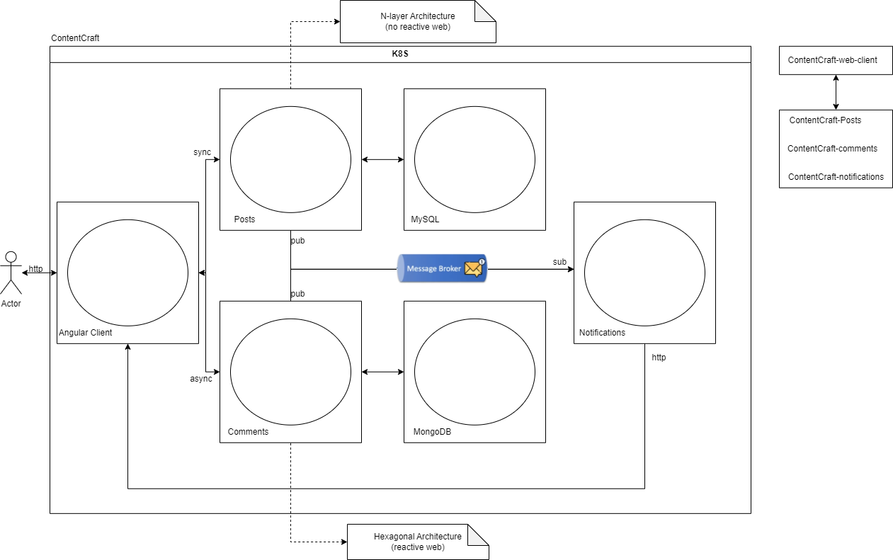

Content Craft Project
===

Description
-----
The project is designed to manage the following services:
* Posts service
* Comments service
* Notifications service
 
This project is available for the following objectives:
* To understand differences between architectures and their use cases.
* To understand how Apache Kafka works
* To understand how kubernetes works (single-node cluster)

> Diagram

References
----------
* https://kubernetes.io/
* https://kafka.apache.org/

Licence
-------
N/A